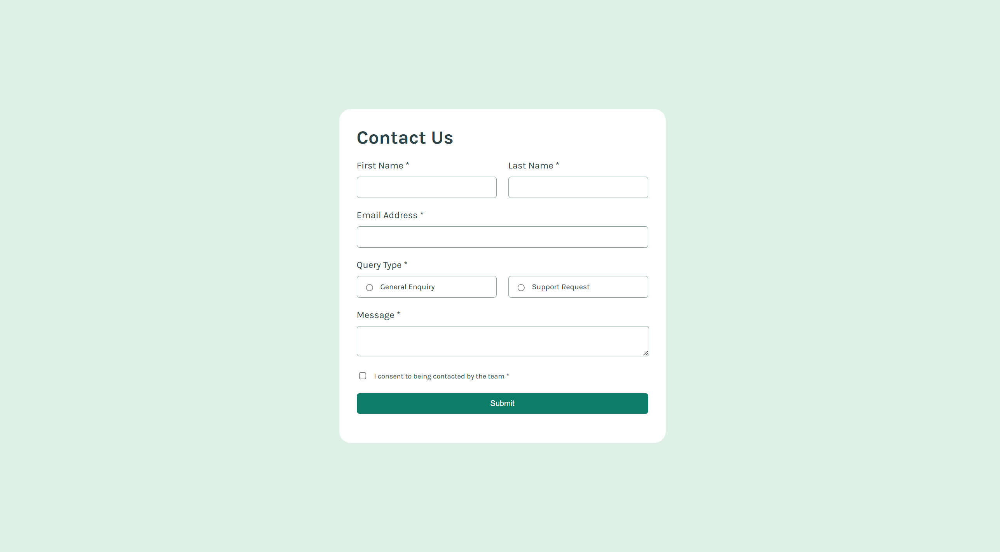

# Frontend Mentor - Contact form solution

This is a solution to the [Contact form challenge on Frontend Mentor](https://www.frontendmentor.io/challenges/contact-form--G-hYlqKJj). Frontend Mentor challenges help you improve your coding skills by building realistic projects. 

## Overview

### The challenge

Users should be able to:

- Complete the form and see a success toast message upon successful submission
- Receive form validation messages if:
  - A required field has been missed
  - The email address is not formatted correctly
- Complete the form only using their keyboard
- Have inputs, error messages, and the success message announced on their screen reader
- View the optimal layout for the interface depending on their device's screen size
- See hover and focus states for all interactive elements on the page

### Screenshot



### Links

- Solution URL: [Solution](https://github.com/aisyahhannes/contact-form-frontend-mentor)
- Live Site URL: [Live site](https://aisyahhannes.github.io/contact-form-frontend-mentor)

## My process

### What I learned

```js
// Using forEach to loop through multiple elements  
function highlightSelectedQuery() {  
  const selectedQuery = document.querySelector('input[name="type"]:checked');  
  const allQueries = document.querySelectorAll('input[name="type"]');  

  allQueries.forEach(query => {  
    const div = document.querySelector(`.${query.id}`);  

    if (query === selectedQuery) {
      div.classList.add("check");
    } else {
      div.classList.remove("check");
    }
  });
}

// Using setTimeout to hide an alert after 3 seconds  
function showAlert() {  
  document.getElementById("alert").style.display = "block";  

  setTimeout(() => {  
    document.getElementById("alert").style.display = "none";  
  }, 3000);  
}

// Resetting the form after submission  
function resetForm() {  
  document.querySelector("form").reset();  
  console.log('Form has been reset! 🎉');  
}
```